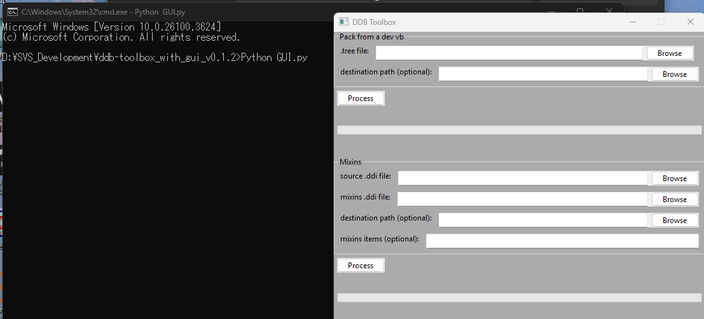
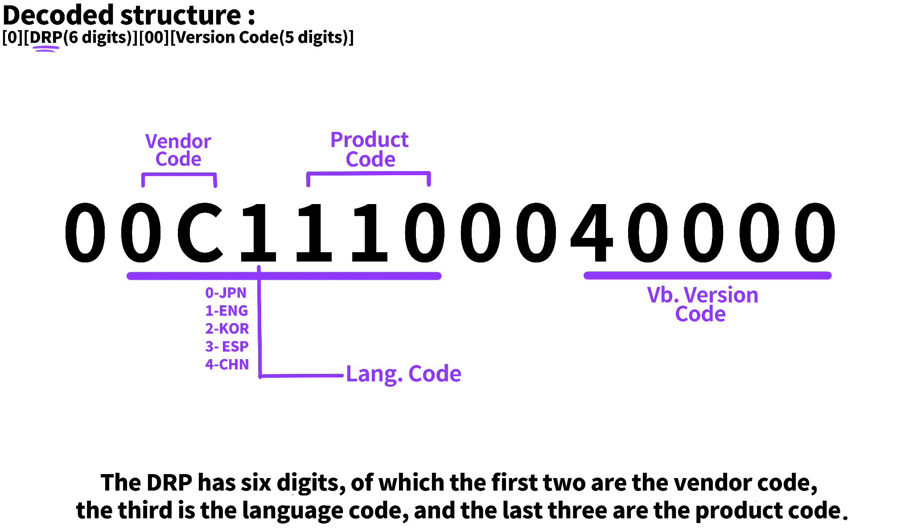

# Compiling a database / Component IDs

## What's needed ?

> Your voicebank with a complete configuration

> [Python 3.10](https://www.python.org/downloads/release/python-3100/)

> [Yuukawa Hiroshi's DDBTools](https://github.com/yuukawahiroshi/ddb-tools)

??? question "What about my environ-"
    No, you do not need to use conda for this.

Once you’ve downloaded everything and set up Python, proceed with installing the
requirements via the following commands in your terminal :

> cd [path to ddbtools directory]
> pip install -r requirements.txt*

!!! danger "Author's note"
    Requirement installation may take a while, especially if this is your first time
    setting up a Python environment

Next, you’re going to package your voicebank. Remember that everything needs to be
in order, all of your data needs to be added to the database and everything needs to be
configured. Do not use incomplete voicebanks. If you just want to run a quick test you
should either trim out unfinished entries or use the V4 Developer Editor.

If you’re using the GUI, run the following commands :

> cd [path to ddbtools directory]

> python GUI.py

As soon as you input the second command, the gui should appear. Link your singers
.tree file and just hit ‘Process’. Depending on your database size it may take a while.
Just let it run in the background. Once it’s done, the tool will notify you.

If you’re using the pack_ddb.py script, run the following commands :

> cd [path to ddbtools directory]

> python pack_ddb.py --src_path “ [path to your singers .tree file] “ --dst_path “ [output directory, where your .ddb and .ddi will appear once done] “

Once again, let it run in the background.

So close yet so far, you won’t be able to use the voicebank with just the .ddb and the
.ddi. You also need a .vvd and a Component ID.

## So, what are these files ?

The .vvd is the file that tells your Editor information about your voicebank such as its
name, its CompID, the company it comes from, and so on. (In a nutshell, metadata)

The Component ID is an unique ID issued to each voicebank. It is extremely important
to make sure your databases ID does not overlap with another one.

## How’s a CompID made ?

The shortest way around making a CompID is just using the one the VVDEditor tool
generates for you. I, however, advise you not to do that. Or well at least not always.
The VVDEditor has a limited list of about 20 (or less) IDs and so there’s always going to be
a risk of your IDs overlapping, which you don’t want to happen.

So, ideally you’d write your own.

VOCALOID Component IDs are numeric strings made of 14 digits, each managing a
different aspect of your voicebank such as your vendor code, product code, language
code and version code. Please efer to the graph below for better reference.

