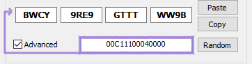
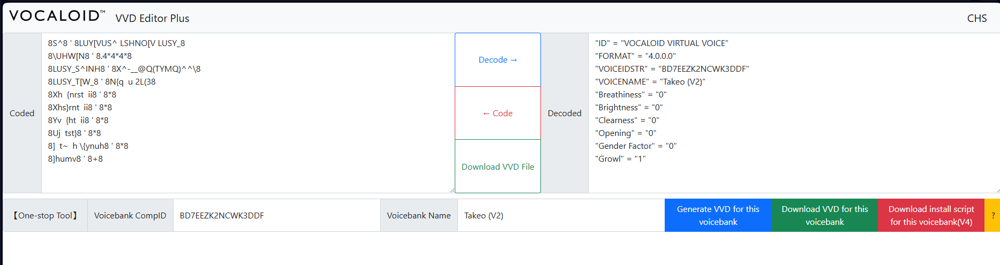

# Component IDs / .vvd

Once you’ve written your ID, you will need to encode it to its regular alphanumeric form
(now made of 16 digits). To achieve this, you will need to use a tool that is able to
convert your string from a format to another. eemorph’s VOCALOID2 Keygen is capable
of this, so we will use it for our example.

Simply, enable ‘Advanced’, input the raw string and let the tool do the encoding job for
you. You are now free to copy the ID and use it for your voicebank. ※ Always ensure you
wrote everything correctly, not doing so can result in encoding errors or voicebank
malfunctions within the Editor.

## How’s a .vvd made ?

First head to the VVD Editor site. If you don’t already have a CompID, click on the
question mark (?) and generate one, or use your own if it is the case. By default the site
only supports Chinese and Japanese, but you can make other languages just fine, too.

Once you have your CompID, go back to the first page and paste it in ‘Voicebank CompID’. Make sure you also type in your singer’s name in ‘Voicebank Name’

## For Your Information :

You can change ‘ID’, though it’s not necessary.
‘FORMAT’ is the voicebank version
‘VOICESTR’ is the CompID
And the rest are all parameters. *Note : If you’re making a V3 database, remember to
completely remove ‘Growl’
If you make any edits, remember to hit ‘Code’.

Once you’re done, click on ‘Download VVD File’ and alternatively also generate .bat
install scripts for it via ‘Download script for this voicebank’. Though you don’t need to
do this, it’s optional. (Allow it to download multiple files)

## Last but not least, final folder preparation

Make a folder with your .ddb, .ddi, .vvd and name it your voicebanks CompID. Remember
to also make sure that all files have the same name, otherwise your Editor might not be
able to read the singer. (You can change all the file names later too)

※ OPTIONAL, Mixins/Growl packaging for V4
※ To add; custom VQM via ddiview

## What's needed ?

> An already compiled database

> A V4 database WITH growl (V4flower, Cyber Songman, etc.)

> ddbtools (linked previously)

The process both for the GUI and the script are very similar to the ones for the actual
compiling, so I won’t be re-explaining all of it.

If you’re using the GUI :

> Source .ddi file is the V4 singer you’ll be taking the growl from

> Mixins .ddi file is the ‘target’ .ddi, in other words your singers file

If you’re using mixins_ddb.py :

> cd [path to ddbtools directory]

> python mixins_ddb.py --src_path “ [path to your voicebanks .ddi file] ” --mixins_path “[path to the .ddi you're taking the growl from] --dst_path “ [output directory]”

!!! danger "Author's note"
    Don’t make multiple CompIDs for the same voicebank ! You are allowed to
    reuse the same one in the case of repackages.

