# Vocaloid Editor Import process

Once you have your packaged voicebank (and if it’s the case, installer), you’ll be able to
load it in with Vocaloid 4FE+ Alpha using its Voiceloader/Voicebank Client. So start it
up, locate your voicebank via ‘File import’ and optionally unlock the XSY.

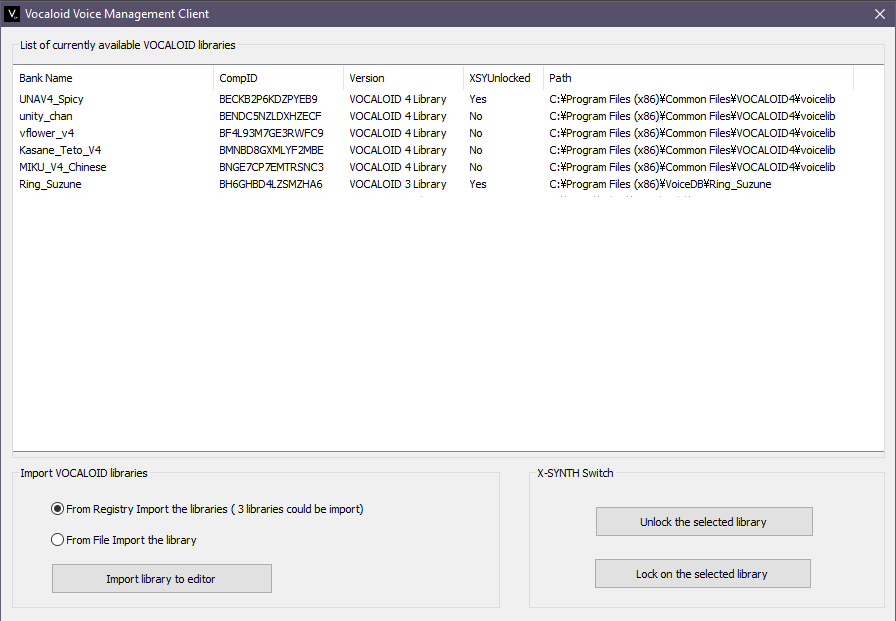

Using the Singer editor you can set your default singer, make XSY presets, and others.

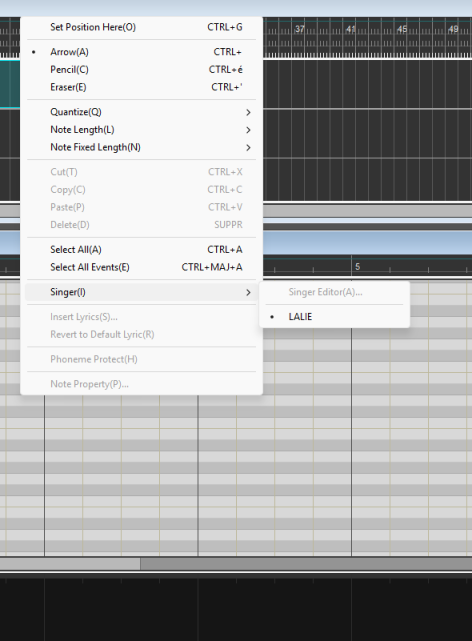

Getting your voice in the Vocaloid5/6 Editors is just as simple, run the .bat installer
generated via VVD Editor Plus as admin, run Vocareg one time, done (this is in the case
of FE libraries, the workflow for ‘legal’ databases is significantly different).

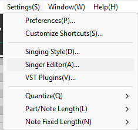

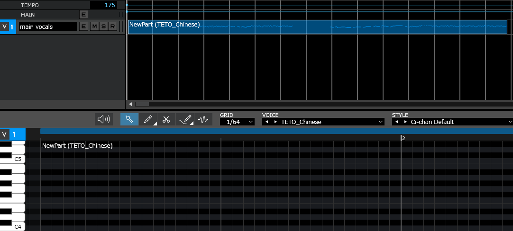

Doing it like this will also have your voice show up in Tunelab, making it fully usable.

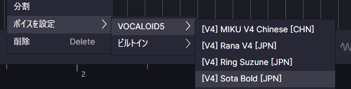

## About portraits :

You will need to look in :

> C:\Program Files\Common Files\VOCALOID5\Resource\Voice

> C:\Program Files\Common Files\VOCALOID6\Resource\Voice

> Make a folder with the voicebank’s compID as its name inside either of the paths mentioned above

> Inside your newly created folder, add an image named setup.bmp; dimensions need
to be 600x324.

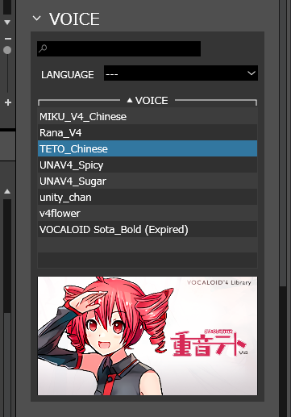

!!! danger "Author's note"
    Always remember to maintain the correct dimensions for setup .bmps !

## Vocaloid 4 Dev Usage

??? question "...What about VIVI?"
    No, you do not need VIVI’s voicebank, if you are wondering.
    Either way, your storage is gonna thank you for not keeping her.

You will need to set up the Dev Editor, and then ink the path to your bank. As you may
already know, Vocaloid can’t run without at least one installed voicebank, so keep that
in mind. A database will be required for the Editor to start, just like with regular versions.

In the DB_Dev.ini, copy your paths and set ‘BankSelect’ to your language of choice.
VVoice, ProgramChange, and ComponentID will go up by 1 as you add Voicebank
entries to the .ini, DBPath should be set to the folder housing your singer.inf, and
DBName the path to your .tree file. VVoiceName can be anything, usually just the
singer’s name.

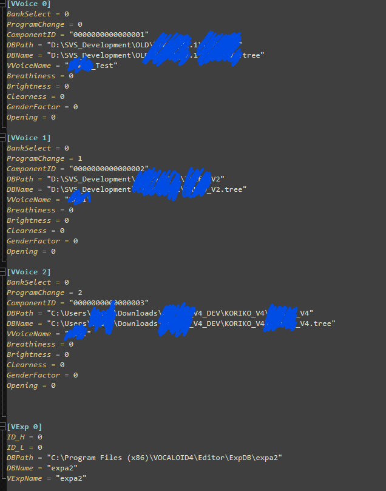

!!! danger "Author's note"
    This version of the Vocaloid Editor is used strictly for testing purposes,
    meaning it has certain limits such as no XSY Cross Synthesis support and
    others.

## SYNTHESIS_WORKSPACE(W)

Synthesis Workspace is one of DBTool's many interesting features. In essence, it allows
you to directly view how the Vocaloid Editor uses your voicebank. To access this, simply
render out a sequence from the Dev Editor and save the .msd together with it.

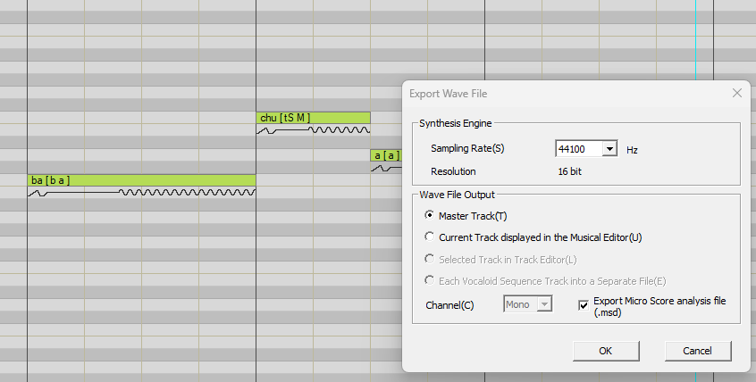

Returning to the DBTool; make sure your singer is loaded, then click
SYNTHESIS_WORKSPACE.

Load your wave file. (The .msd will auto-load.)

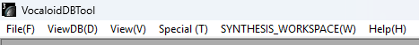

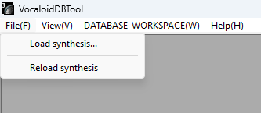

And now you have a direct look at what is happening inside your voicebank.

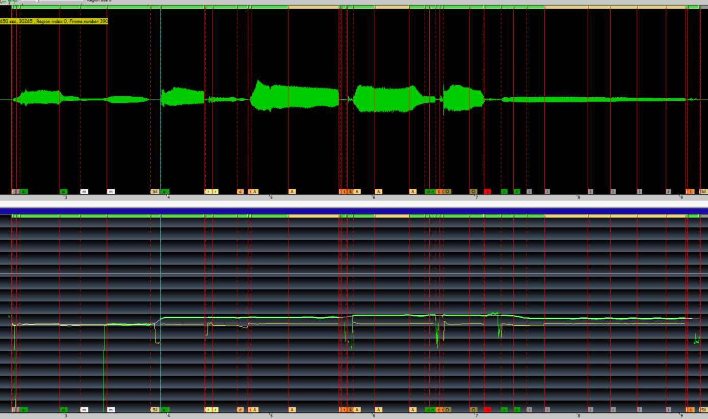

This is good to keep in mind, as it can allow you to track down issues such as speech or
pitch defects.

