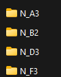
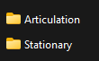
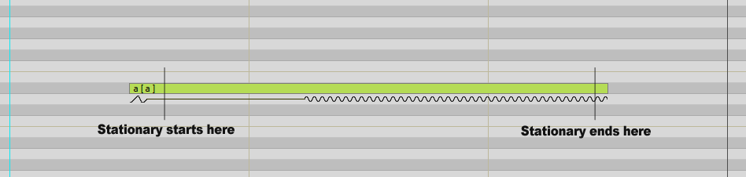
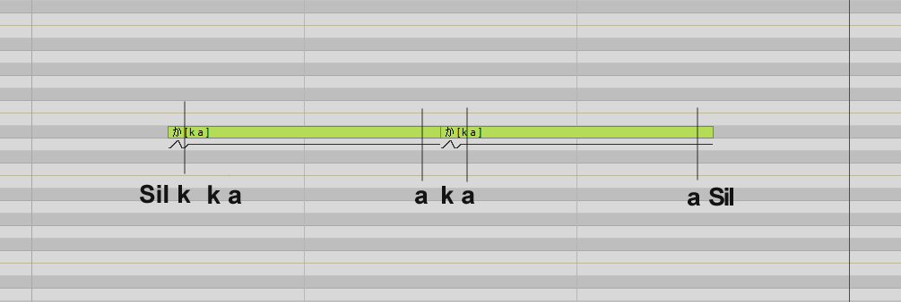

## Folder preparation

This process is eerily similar to building an UTAU bank. It’s basic; map out your
pitches, prepare your folder and add your recordings inside them. You should do at
most 11 pitches, avoid going over this amount.

Vocaloid uses ‘stationaries’ and ‘articulations’. Stationary samples are what help a
voicebank hold its pitch in the middle of a note. You can think of them as a V sample.

Articulations can be CV, CVVC. VCV, etc. In more technical terms, Articulation means
distinction of speech.

There are no limits for samples; audio manipulation, post processing via a DAW,
voice-acting, etc. are all OK.

In simpler terms:

> New folder (Your voicebank’s name) ;

> Pitch Folders (if applicable; monopitch voicebanks are OK) ;

> Articulation / Stationary Folders.

!!! danger "Author's note"
    1. The N_ in the screenshots stands for ‘Normal’, it is not mandatory.
    2. Your audio format matters ! It is always the same no matter what, .wav, mono
    channel, 44.1KHZ, 16bit.
	3. The DBTool is able to read subfolders. Folder names do not matter, they are purely for organization.

## What are Articulations/Stationaries ?

A more in-depth explanation :

A Stationary, or The Looped sample is a short-sustained audio file that is looped in the
editor for longer notes. It’s where more of the Vocaloids tone comes from. In fact,
these aren’t always limited to just vowels, but sometimes consonants like N or in
English, L. They are 100% needed and should not be skipped during production.

!!! danger "Author's note"
    Example : For Japanese, typically, Stationaries will include : a, i, u, e, o, n.

An Articulation or The Connecting sample is how your C’s connect with your V’s.
There’s no end or limit for articulations. Fine-Tuning your speech is fully up to you to
optimize. This means CVs, VC’s, even CCV’s if you have to. In even shorter terms,
like mentioned before, they are CV, CVVC, VCV, etc.

