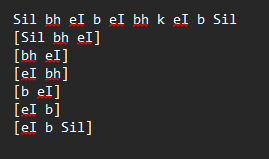
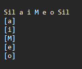

# Transcriptions

Transcriptions are just what they sound like. They are .txt files with their extension
renamed to .trans. You should always ensure a transcription file has the same name
as its corresponding audio file. These files have to be in the same folder as their audio
counterparts. You’d need a pair for every file in every pitch. They are similar to UTAU
oto’s Aliasing.

In other words, they specify what the sample is and what phonemes should be taken
from it.

Below are examples of how to transcript an audio file.

!!! danger "Author's note"
    You should always make sure .wav files and .trans files reside in the same folder.

1. Say we have a ‘ _b_ey_b_ey_b_k_ey_b-.wav ‘. This is for an articulation
transcription
2. You need to create a _b_ey_b_ey_b_k_ey_b-.trans. Open this file with either
the regular Windows notepad, or Notepad++
3. Typically, transcriptions use the x-sampa phonetic system, however there are
no restrictions. You can work with other systems such as arpa as well.
4. ‘b ey b ey b k ey b’ is turned into ‘Sil bh eI b eI bh kh eI b Sil’ in one line of text
on your file. (Sil is short for silence, and can be used in editor)
5. Underneath you will begin to section off the pieces of audio you’d want to pull
from this line using brackets, such as ‘[Sil bh ey]’ ‘[ey b]’ etc. The below image is an
example for visual reference.

!!! danger "Author's note"
    Articulations allow multiple phonemes per bracket, while Stationaries
    only allow one phoneme per bracket. Please check the example images for
    visual reference.

1. Say we have an ‘ _a_i_u_e_o.wav ‘. This is for a Stationary transcription.
2. You need to create an ‘ _a_i_u_e_o.trans’.
3. Typically, transcriptions use the x-sampa phonetic system, however there are
no restrictions. You can work with other systems such as arpa as well.
4. ‘a i u e o’ is turned into ‘Sil a i M e o Sil’ in one line of text on your file.
5. Underneath you will begin to section off the pieces of audio you’d want to pull
from this line using brackets, such as ‘[a]’ ‘[i]’ etc. The below image is an
example for visual reference.

!!! danger "Author's note"
    A note about Step 5. and bracket transcriptions : Transcribing all syllables in a
    sample is not necessary. You are free to optimize transcriptions however you’d like as
    long as you are sure you have all needed sounds and phonetic combinations. It is also
    highly recommended to avoid duplicates per pitch (for example : [b a] appearing twice in
    your transcription).

Vocaloid uses a ‘context’ system that allows for certain phonetics to only show up
certain scenarios, such as the different N’s in Japanese, or the English aspirated or
unaspirated consonants. Below are listed examples using all of them. Please be sure
to transcript these accordingly.

!!! danger "Author's note"
    Most often these apply to Japanese.

| Stationary | Phonetic | Usage Example |
|---|---|---|
| Yes | N\ | [a] [i] [u] [e] [o] [j] [w] [h] [h/] [p/] [p/’] [C] [s] [S] |
| Yes | n | [n] [t] [t'] [ts] [tS] [d] [d'] [dZ] [dz] [4] [4'] [Z] [z] [m] [m'] [J] [N] [N’] [N/] |
| Yes | J | [J] |
| Yes | N | [N] [k] [g] |
| Yes | N’ | [N’] [k’] [g’] |
| Yes | m | [m] [p] [b] |
| Yes | m’ | [m’] [p’] [b’] |
| No | b’ d’ p\’ g’ C k’ m’ J p’ 4’ t’ | [i] |
| No | bh dh gh kh ph th | Aspirated eng |
| No | b d g k p t | Unaspirated eng |
| No | l0 | Light l |
| Yes | l | Dark l |

As you can see some of these will need stationeries. Not just in Japanese but English
or any other language you may be working in. Please be careful if you choose not to
work in x-sampa, though the rules generally stay the same.

!!! danger "Author's note"
    You should not let Vocaloid fill in gaps for phonetic transitions on its own as it will
    give you extremely harsh sounding results and outputs in the Editor. An empty transition
    means an empty gap in your voicebank. Always ensure you have all needed phonetic
    transitions for the best results.

    For a quicker workaround you can use the AutoTrans tools listed in ‘Resources’,
    however please always carefully revise and correct your transcriptions if it is the case.

