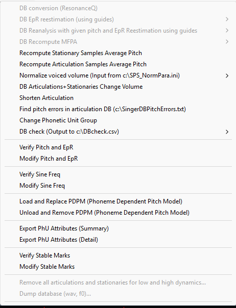
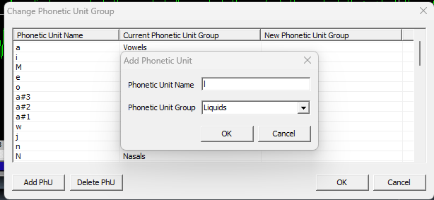
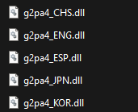
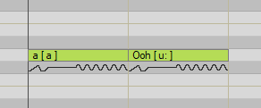

## Dictionary

In case your dictionary is missing a phoneme, or has a wrongly categorized phoneme
go to Special > Change Phonetic Unit Group, and make all needed corrections.



In this window you can add phonetics based on their type and usage in speech. Note
that after making an edit, the DBTool will close your singer, requiring you to reopen it
yourself.



There are realistically little to no limits for this, so feel free to experiment with all kinds
of different sounds.

## OPTIONAL / Custom G2PA (Syllables don’t work)

Alright, maybe you’re feeling adventurous. You want to implement support for a
language that isn’t already supported natively, or even a phonetic system.
Assuming not every reader of this document knows what a G2PA or an X-Sampa is, I’ll
try my best to cover everything you need to know for this segment.

## What are G2PAs ?

If you’ve looked through Vocaloids files at least once before, chances are you saw
several .dll files labeled like ‘g2pa3_JPN.dll’ or ‘g2pa3_ENG.dll’.

In simple terms, their role is to convert your inputs in the Editor to phonetic symbols for
the voicebank to actually be able to read your syllables. Ever noticed how on a note,
right next to your あ there's an ‘a’ between brackets ( [a] ) ? That’s the phonetic
transcription of your input, basically the G2PA doing its job. They’re essentially just
phonemizers.



## What the hell is an X-Sampa ?

Let’s get something out of the way. X-Sampa is NOT a Vocaloid thing.

X-Sampa (Extended Speech Assessment Methods Phonetic Alphabet) is a system for
representing the International Phonetic Alphabet using ASCII characters. Miku did not
come up with this.

Vocaloid uses X-Sampa for the phonetic system. So typically, you’d work with it when
making a dictionary and a G2PA. Despite that, implementing your own system is
completely possible as long as you do it correctly and optimize it for Vocaloid.



## So how do I make one myself ? And how do I get it to work in my Editor ?

A template is included in the resources tab of the page. Search for the
Custom G2PA Base.

The .zip file includes a .dll and a .ini. Both work fine. Vocaloid should be able to read
both kinds of files. If you know your way around writing and making an actual dynamic
link library, be my guest. However not everyone knows how magic like that is done, and
that’s why I’ll be explaining the easier method, which is writing a .ini instead of a .dll.

I’ll assume you already prepared a dictionary as well as a voicebank configured with
said dictionary, really all you need to do is write the phonetic transcription equivalents to
your syllables.

For example,

```ini
[PhoneticArray]
a=a
ka=k a
ke=k e
..and so on
```

It should be fairly simple. You only need patience and time for this one. And of course
like I already mentioned a pre-made dictionary to base the G2PA off.

Getting it into the Editor is where things can get a tad bit tricky. But don’t worry, as long
as you’re careful to not mess with the wrong thing it should be all good.

Once you’re done writing your G2PA, go to C:\Program Files
(x86)\VOCALOID4\Editor or C:\Program Files (x86)\Vocaloid4FE if you’re using FE,
and add your phonemizer.

By default, Vocaloid is limited to only 5 G2PAs at a time, since it has only 5 slots in the
Registry.

To add your own slot for your own phonemizer, you’re going to head to your Registry
Editor,

`COMPUTER\HKEY_LOCAL_MACHINE\SOFTWARE\WOW6432Node\VOCALOID4\COM\MON\LANGUAGE`
OR,
`COMPUTER\HKEY_LOCAL_MACHINE\SOFTWARE\WOW6432Node\POCALOID4\COM\MON\LANGUAGE` if you’re using FE.

From there, right click and create a new key (New > Key). The number is completely
arbitrary, but for this example we’ll name it ‘5’.

Inside the key you’ve just made, create a new string value (‘New > String Value’)
Double click the string, and change ‘Value Name’ to ‘g2pa’ and ‘Value Data’ to your
G2PAs name. (Example : g2pa4_CHS.dll, g2pa4_CHS.ini)

You’re done, your custom G2PA should now work within Vocaloid. (Special thanks 2
ZouZouPowa for figuring this part out !!)

