## Segmentation / Annotation (DB Configuration)

To open the configuration dialog, do File > Automatic Segmentation, and then locate
your wav+trans files (including subfolders is OK, however please ensure you have all
transcriptions prepared).

!!! danger "Author's note"
    Despite the name ‘Automatic Database Creation Dialog’, the configuration
    process is not actually automatic.

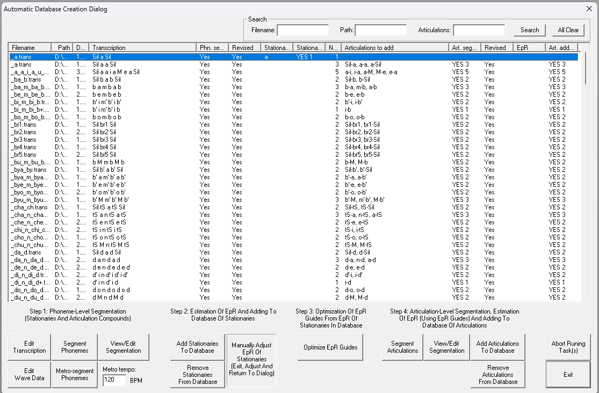

This dialog will be used to do all voicebank configuration related work. You can use it
to edit your transcriptions and generate / edit your segmentation files and add them to
your database.

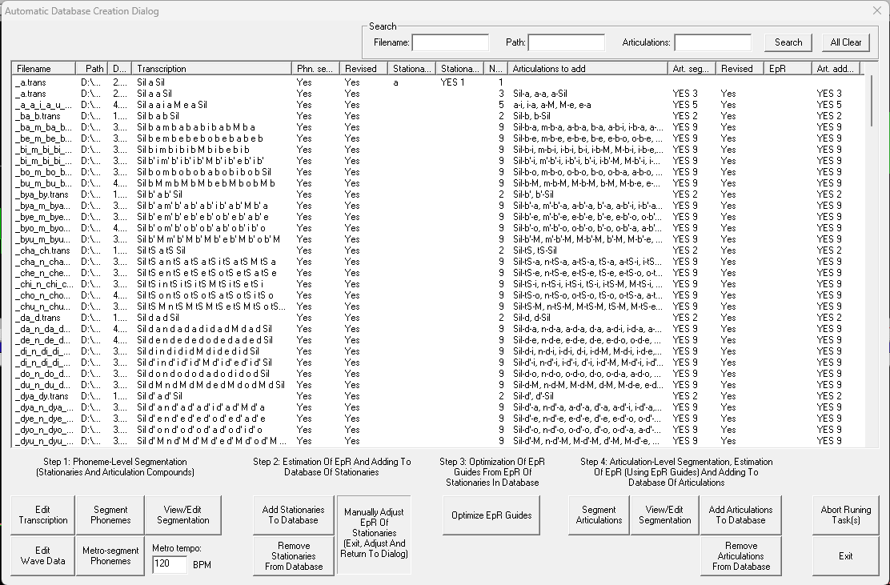

!!! danger "Author's note"
    Tip : File > Preference allows you to add the an external audio editor (such as
    Audacity, Sound Forge, etc.) that you can open via ‘Edit Wave Data’ inside the
    Database Creation Dialog.

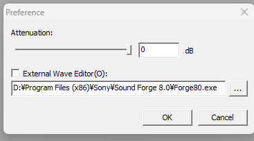

!!! danger "Author's note"
    Completion of Step 3 ‘Optimization of EpR Guides’ is not always necessary
    and can be safely ignored.

You should always ensure that all phonemes included in your transcription files are
also present in your dictionary .txt file in order to avoid segmentation errors. Please
also remember that Stationaries and Articulations do differ, and that the configuration
method for the two is not the same.

!!! danger "Author's note"
    Please always segment phonemes before viewing your segmentation, doing
    otherwise will result in DBTool crashing.
    Ignoring ‘Error-Forced Segmentation’ is OK as this occurance is normal and
    happens on all occasions.

Below is an image of the Segmentation View/Edit window.

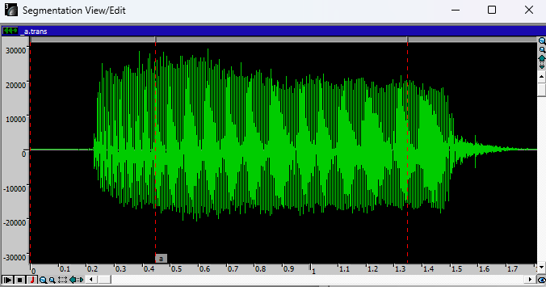

The green waveform represents your recording, the red markers represent the segments,
and the small tag is the phonetic corresponding to your transcription file.

To move a segment, you will need to click the gray bar between the segments
you wish to edit and move the red markers.

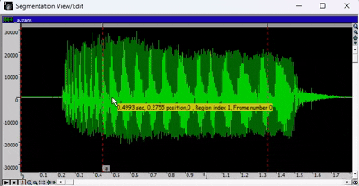

To zoom in or out, use the green arrows or the magnifying glass icon, both
present in the toolbar of the window.

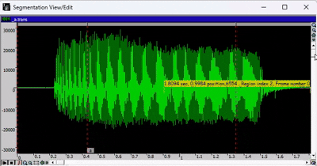

To select a specific region of audio, hold SHIFT and select it manually using
your cursor. To deselect, hold SHIFT and click.

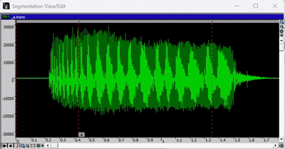

To play the recording, press SPACE. If a region of the audio is selected, the
playback will only be the selected part.

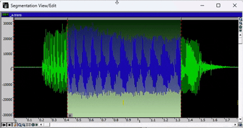

After completing your segmentation, close the Segmentation View/Edit window.
The ‘Yes’ under ‘Phn. Segmentation’ and ‘Revised’ means that the tool
successfully registered your edits.

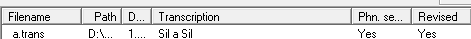

Overall, for this part of the production process, you only need precision and patience.
A rushed segmentation is no good, so please remember to take as much time as you
need.

For Stationaries, the following workflow is applied :

1. Segment Phonemes ;
2. View/Edit Segmentation (※ Do not skip this.) ;
3. Add Stationeries To Database.

!!! danger "Author's note"
    When configuring Stationaries, you should always select the most stable part
    of the audio. You should also ensure that the selected portion is not too long,
    nor too short. The image below is an example.

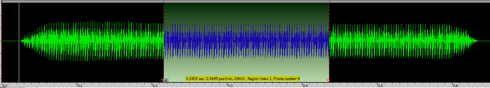

For Articulations, the following workflow is applied :

1. Segment Phonemes ;

2. View/Edit Segmentation (※ Do not skip this.) ;

3. Segment Articulations ;

4. View/Edit Segmentation (※ Do not skip this; corrections/adjustments may
be needed. Please always revise your final segmentation before adding to
the database.)

5. Add Articulations To Database.

!!! danger "Author's note"
    In syllables like ‘kya’ (きゃ) , the ‘y’ sound is separated from the
    vowel, so ensure not to include the ‘ya’ sound in the k’ marker.

Below are examples of how various transitions look inside the DBTool :

1 phonetic transition

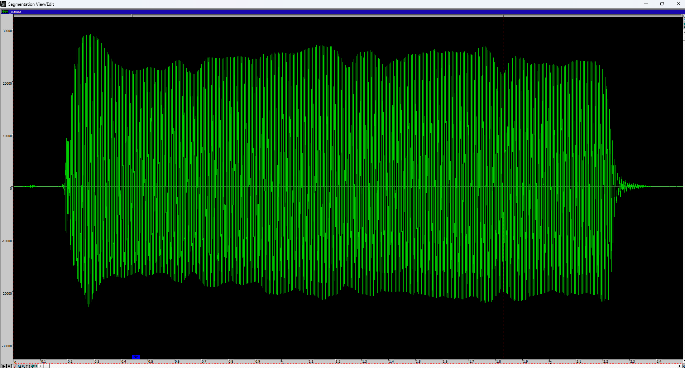

6 phonetic transitions

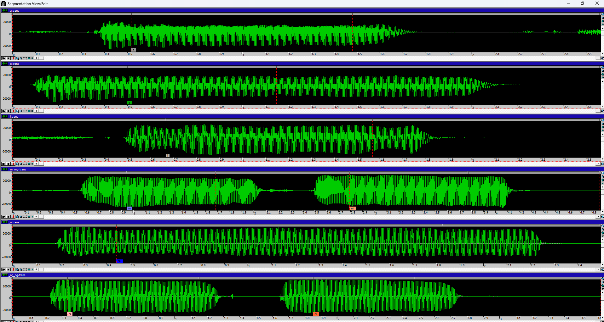

The number of viewable articulations will depend on the number of brackets written in
the transcription.

!!! danger "Author's note"
    You should always optimize your transcriptions as to not have an
    overwhelming amount of brackets. The Articulation Segmentation window gets
    clogged up easily when too many brackets are present, making it hard or simply
    impossible to view your transitions.

Below are examples of how various Articulation transitions look inside the DBTool :

C Articulations (Including all nasal and breaths)
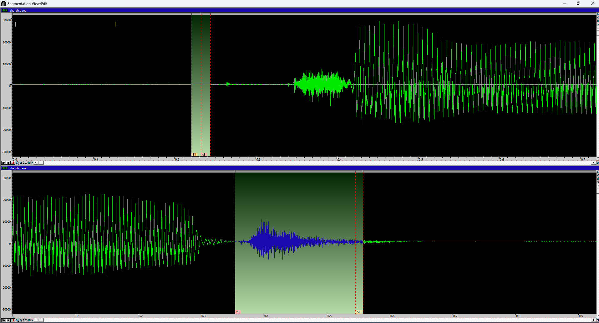

V+VV Articulations (Including N\ and no other nasals)
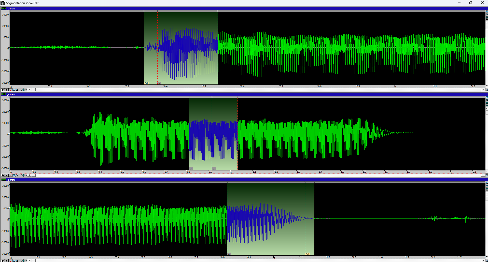

CVVC Articulations
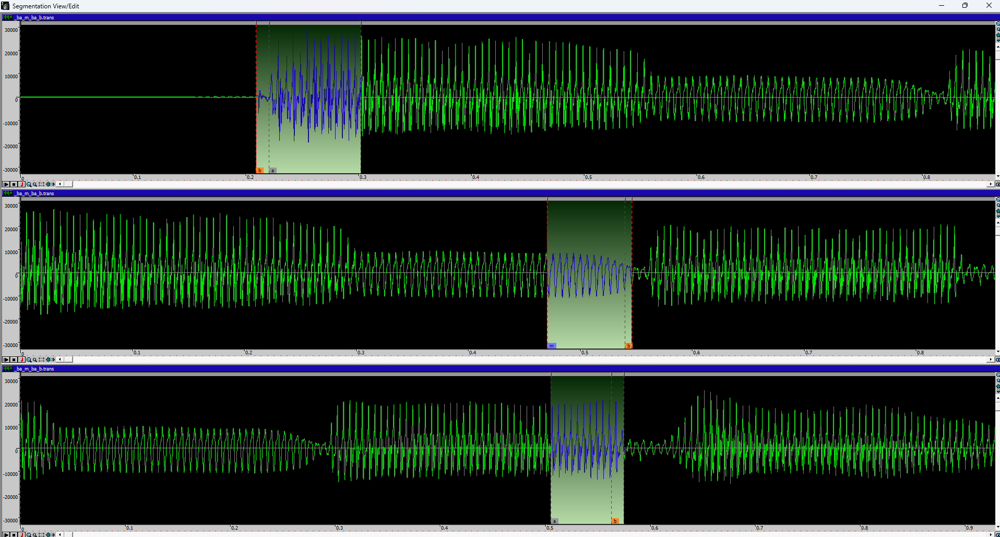

VCV+CVVC Articulations
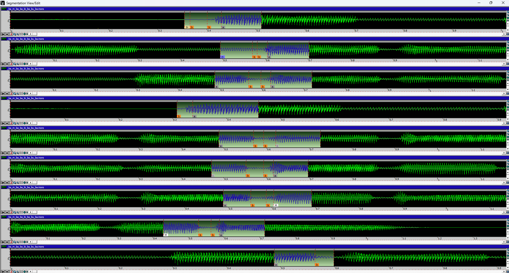

CCV+VCSil Articulations
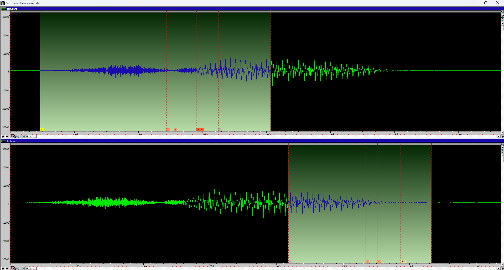

Once added to the database, they will appear under ViewDB.
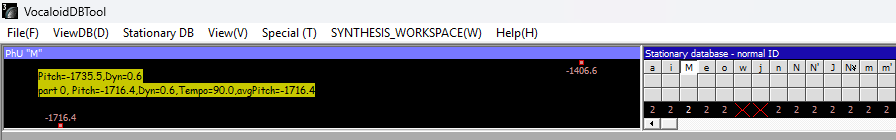

Clicking on the red points will make a menu similar to the one in the Segmentation
Dialog appear, here you can make additional adjustments to your segmentation or
perform f0 estimation (via AttPitchOutput in ‘View’).

!!! danger "Author's note"
    f0 estimation is similar to UTAU .frq editing.
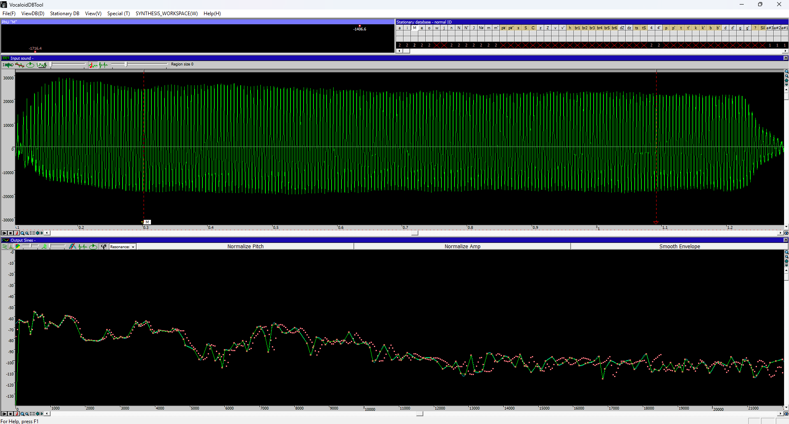

Please always ensure to always update your Database after making corrections via
‘DB Update’, otherwise your progress will not be registered by the application.
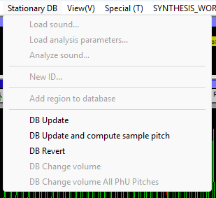

!!! danger "Author's note"
    About .f0 estimation : Use CTRL + click to correct the pitch of the sample (simply
    draw the pitch as you wish), and CTRL + D +click to delete pitch.
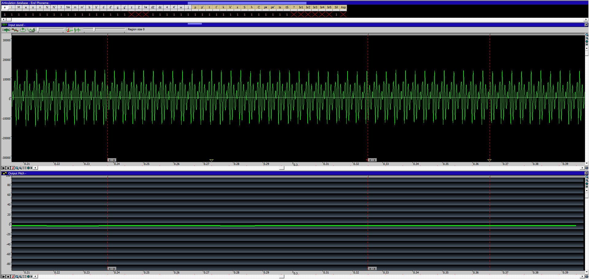

!!! danger "Author's note"
    In all cases, please ensure to remove your Stationaries/Articulations from the
    atabase when making edits, corrections, or adjustments of any sort. Of course,
    you can add them back after you’re done. Not doing so can result in irreparable
    errors.