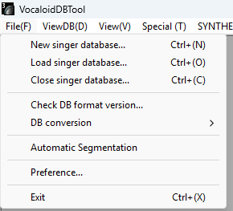
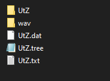
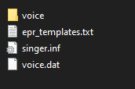
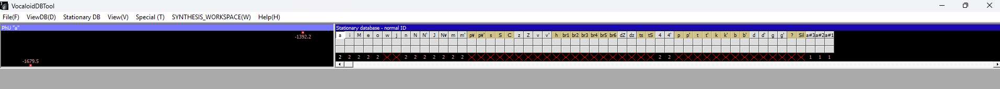
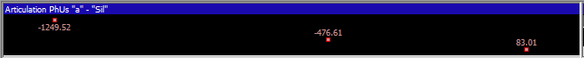

## Starting work on your Database

A dictionary will be needed, so feel free to download one from ‘Resources’. Start by
creating a .txt file and name it your voicebank’s name. Avoid long names and periods.
Click File > New Singer. Load your dictionary, and then load the .txt with your
voicebank’s name. This will auto generate a folder, a .dat, and a .tree with the name
you chose. Use the singer.inf to re-open your voicebank when you return to developing.

!!! danger "Author's note"
    You do not need to worry about saving your progress, the DBTool saves edits
    in real-time.

After you’ve created your database, check ViewDB > Stationary to ensure everything
is correct. Below is an image of what it should look like.

There will be X's under the phonemes, with a mostly empty everything. As you go on
please keep in mind from left to right is Lower to Higher pitch. When you add
recordings, they will appear here as little points. You can click on them to view, listen,
and edit. The X will go up in numbers as you add more recordings.

